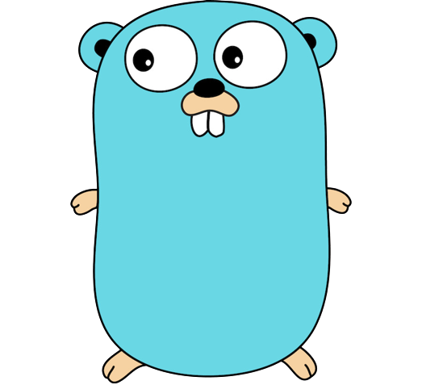
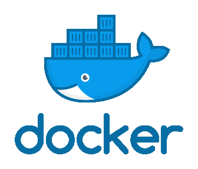
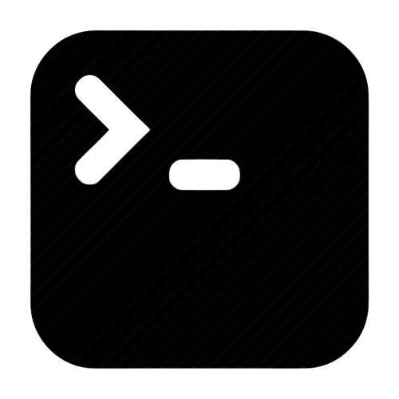

# Hi there, I'm Agrieva Xananda [Jounny][instagram] 👋

## I'm a Fullstack(overflow) web Developer👨‍💻

- 🔭 Check out my fiverr pages: [agrieva][fiverr]!
- 🌱 I’m currently learning everything 🤣
- 👯 I'm looking to collaborate with other developers
- 🥅 2022 Goals: Learn more about mobile development
- ⚡ Fun fact: I love to cooking and play guitar or playing game
- 😻 Check out My Personal website: [Jounny](https://github.com/Jounnyy)

### Connect with me:

### Languages and Tools:

 
 

---

  
:zap: GitHub Stats

  

[instagram]: https://www.instagram.com/real.jounny/

<!-- [linkedin]: https://linkedin.com/in/codeSTACKr -->

[likedin]: https://www.linkedin.com/in/agrieva-xananda-7a753422b/
[fiverr]: https://www.fiverr.com/agrieva?up_rollout=true
